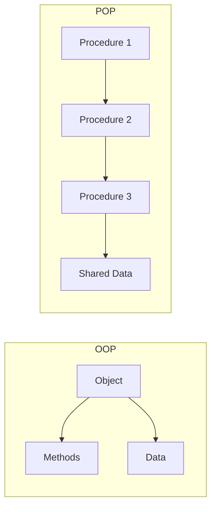

# Object-Oriented Programming (OOP) vs. Procedural-Oriented Programming (POP)

---

## 1️⃣ Procedural-Oriented Programming (POP)

### 📌 Definition
Procedural-Oriented Programming focuses on **functions** (procedures) that operate on data.  
The program is divided into **functions**, and data is passed between them.

### 🔹 Key Features
- Emphasis on **functions**.
- Data is **global** and can be accessed by any function.
- Follows **top-down** approach.
- Reusability is limited compared to OOP.

### 📄 Example (Java Language)
```java
public class SumExample {

    // Method to calculate sum
    public static int sum(int a, int b) {
        return a + b;
    }

    public static void main(String[] args) {
        int x = 10, y = 20;
        int result = sum(x, y);
        System.out.println("Sum = " + result);
    }
}
````

---

## 2️⃣ Object-Oriented Programming (OOP)

### 📌 Definition

Object-Oriented Programming focuses on **objects** that combine **data** (fields) and **methods** (functions).
The program is divided into **classes** and **objects**.

### 🔹 Key Features

* Emphasis on **objects**.
* Data is **encapsulated** within classes.
* Follows **bottom-up** approach.
* High reusability through **inheritance**, **polymorphism**, and **encapsulation**.

### 📄 Example (Java Language)

```java
class Calculator {
    int sum(int a, int b) {
        return a + b;
    }
}

public class Main {
    public static void main(String[] args) {
        Calculator calc = new Calculator();
        int result = calc.sum(10, 20);
        System.out.println("Sum = " + result);
    }
}
```

---

## 📊 Visual Representation



---

## 🔍 Difference Table

| Feature         | POP                             | OOP                         |
| --------------- | ------------------------------- | --------------------------- |
| **Approach**    | Top-down                        | Bottom-up                   |
| **Main Focus**  | Functions                       | Objects                     |
| **Data Access** | Global data shared by functions | Data hidden inside objects  |
| **Reusability** | Low                             | High                        |
| **Security**    | Low (data is exposed)           | High (data is encapsulated) |
| **Examples**    | C, Pascal                       | Java, Python, C++           |

---

✅ **Conclusion:**

* POP is simple and best for small programs.
* OOP is powerful for large and complex systems where reusability, scalability, and maintainability matter.


