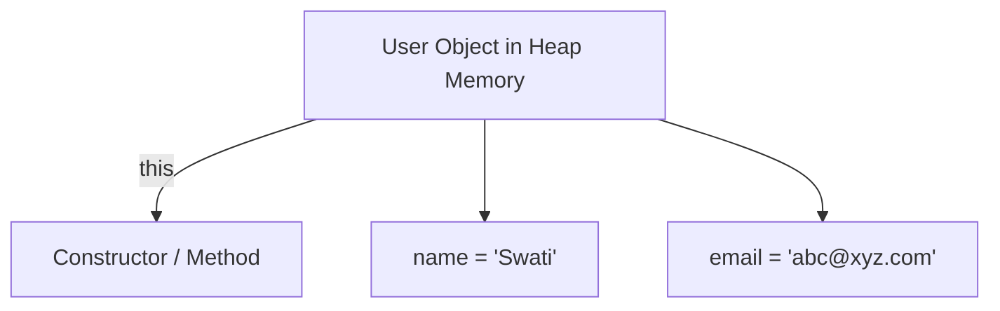

# 📌 `this` Keyword in Java

## **Definition**
The `this` keyword in Java is a reference variable that refers to the **current object** of the class.  
It is used inside an instance method or constructor to:
- Differentiate between instance variables and parameters.
- Call other constructors or methods of the same class.
- Pass or return the current object.

---

## **Examples**

### 1️⃣ Problem Without `this` (Same Variable Names)
```java
class Human {
    String name;
    int age;

    Human(String name, int age) {
        name = name; // ❌ Local variable shadows instance variable
        age = age;   // ❌ Instance variables remain uninitialized
    }
}
````

**Problem:**

* Constructor parameters hide the instance variables.
* `this.name` and `this.age` are never initialized.

---

### 2️⃣ Wrong Attempt – Creating New Object

```java
class Human {
    String name;
    int age;

    Human(String name, int age) {
        Human h = new Human(); // ❌ Creates a new object unnecessarily
        h.name = name;
        h.age = age;
    }
}
```

**Why it’s wrong:**

* Assigning values to another object, not the current one.
* The actual object remains uninitialized.

---

### 3️⃣ Passing the Object Explicitly (Works, But Awkward)

```java
class Human {
    String name;
    int age;

    Human(String name, int age, Human h) {
        h.name = name;
        h.age = age;
    }
}
```

**Issue:**

* Works, but forces passing the same object to the constructor — not intuitive.

---

### 4️⃣ Ideal Solution – Using `this`

```java
class Human {
    String name;
    int age;

    Human(String name, int age) {
        this.name = name; // ✅ Refers to instance variable
        this.age = age;
    }
}
```

**Advantages:**

* Clearly refers to current object.
* Code is clean, readable, and intuitive.

---

## **Uses of `this` Keyword**

1. **Referring to current class instance variables**

   * Differentiate between instance variables and local variables with same names.
2. **Invoking current class methods**
3. **Constructor Chaining** – calling one constructor from another.
4. **Passing current object as a parameter**
5. **Returning current object** – useful in method chaining.

---

## **Real-Time Project Example**

**Scenario: User Registration in an Android App**

```java
public class User {
    String name;
    String email;

    public User(String name, String email) {
        this.name = name;   // Differentiates instance variable from parameter
        this.email = email;
    }

    public void displayUser() {
        System.out.println("Name: " + this.name);
        System.out.println("Email: " + this.email);
    }
}

public class Main {
    public static void main(String[] args) {
        User user = new User("Swati Pandey", "swati@example.com");
        user.displayUser();
    }
}
```

---

## **Diagram: How `this` Works** (Mermaid Diagram)



---

## **Interview Questions**

1. What is the purpose of the `this` keyword in Java?
2. How does `this` help in constructor chaining?
3. Can `this` keyword be used in static methods? Why or why not?
4. Give a real-time example where `this` keyword is essential.
5. Difference between `this` and `super` keywords?

---

```

---


